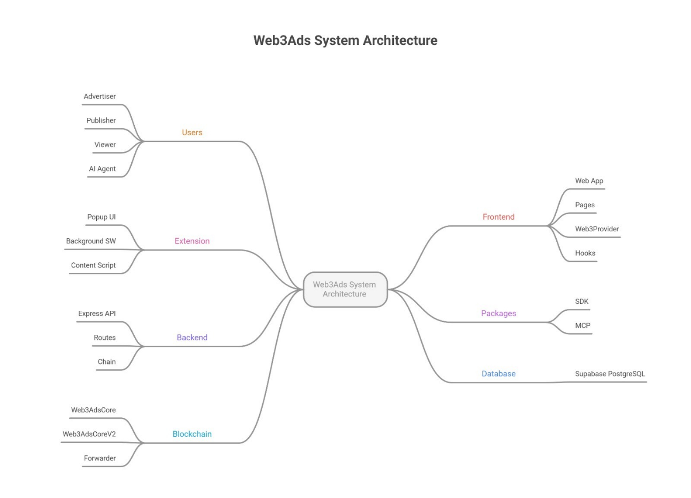
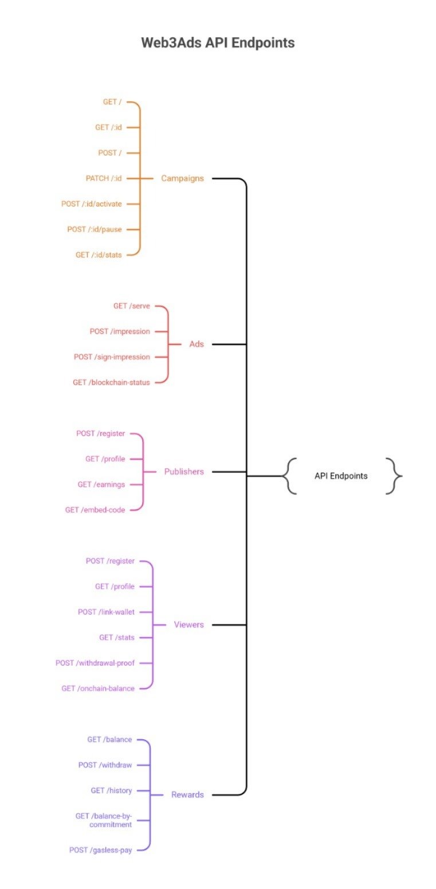
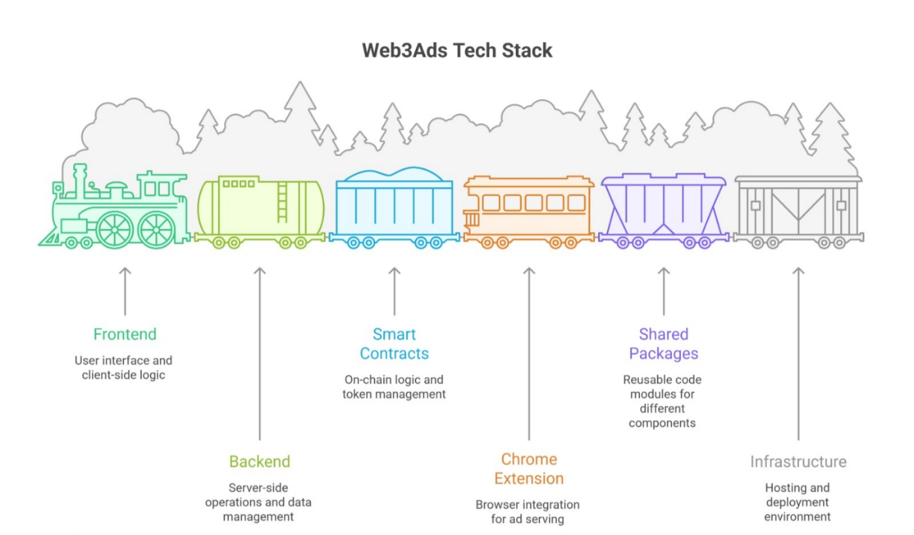

<p align="center">
  
</p>

<p align="center">
  <strong>Decentralized Advertising Platform</strong><br>
  Where advertisers, publishers, and viewers all earn fair value
</p>

<p align="center">
  <a href="#features">Features</a> •
  <a href="#architecture">Architecture</a> •
  <a href="#quick-start">Quick Start</a> •
  <a href="#api-reference">API</a> •
  <a href="#smart-contracts">Contracts</a> •
  <a href="#ai-agents">AI Agents</a>
</p>

---

## Overview

Web3Ads is a full-stack decentralized advertising platform that fairly distributes revenue between advertisers, publishers, and viewers. Built on Base L2 for low-cost transactions, it features privacy-preserving ad tracking using Semaphore zkProofs and supports gasless transactions so viewers never need ETH to withdraw earnings.

### How It Works

<p align="center">
  
  
  
</p>

**Revenue Distribution:**

- **Publishers:** 50% of ad spend
- **Viewers:** 20% of ad spend
- **Platform:** 30% of ad spend

---

## Features

### For Advertisers

- Create and fund campaigns with native ETH
- Target ads by category (DeFi, NFT, Gaming, etc.)
- Real-time analytics: impressions, clicks, spend
- Multiple ad formats: banner, square, sidebar, interstitial

### For Publishers

- Embed ads via React SDK (`web3ads-react`)
- Automatic revenue tracking per impression
- Gasless withdrawals to any wallet
- Simple integration: single React component

### For Viewers

- Earn ETH by viewing ads (no wallet needed initially)
- Privacy-preserving tracking via zkProofs
- Gasless withdrawals - platform pays gas fees
- Chrome extension for identity management

### Technical Highlights

- **Base L2:** Low gas costs (~$0.01 per transaction)
- **Semaphore zkProofs:** Anonymous ad tracking without compromising privacy
- **ERC-2771 Gasless:** Viewers withdraw without owning ETH
- **x402 Protocol:** AI agents can pay for APIs using ad earnings
- **MCP Server:** Model Context Protocol for Claude/AI agent integration

---

## Architecture

```
┌─────────────────────────────────────────────────────────────────────────┐
│                           WEB3ADS PLATFORM                              │
├─────────────────────────────────────────────────────────────────────────┤
│                                                                         │
│   ┌─────────────────┐  ┌─────────────────┐  ┌─────────────────┐        │
│   │   Advertisers   │  │   Publishers    │  │    Viewers      │        │
│   │   (Web App)     │  │  (React SDK)    │  │  (Extension)    │        │
│   └────────┬────────┘  └────────┬────────┘  └────────┬────────┘        │
│            │                    │                    │                  │
│            ▼                    ▼                    ▼                  │
│   ┌─────────────────────────────────────────────────────────────┐      │
│   │                    EXPRESS API SERVER                        │      │
│   │  • Campaign CRUD    • Ad Serving    • Impression Tracking   │      │
│   │  • Reward Calc      • zkProof Verify • x402 Payments        │      │
│   └─────────────────────────────────────────────────────────────┘      │
│            │                                                            │
│            ▼                                                            │
│   ┌──────────────────┐  ┌──────────────────┐  ┌──────────────────┐     │
│   │  Smart Contracts │  │    Semaphore     │  │    MCP Server    │     │
│   │    (Base L2)     │  │   (zkProofs)     │  │   (AI Agents)    │     │
│   └──────────────────┘  └──────────────────┘  └──────────────────┘     │
│                                                                         │
└─────────────────────────────────────────────────────────────────────────┘
```

**Project Structure:**

```
web3ads/
├── client/              # React web app (Vite + TypeScript + Tailwind)
├── server/              # Express API (Prisma + PostgreSQL)
├── contracts/           # Solidity smart contracts (Foundry)
├── extension/           # Chrome extension (React + Manifest V3)
└── packages/
    ├── react/           # web3ads-react npm package
    ├── mcp-server/      # MCP server for AI agents
    └── openclaw-skill/  # OpenClaw skill-pack
```

---

## Quick Start

### Prerequisites

- Node.js >= 22
- pnpm (`npm install -g pnpm`)
- PostgreSQL (via Supabase or local)

### Installation

```bash
# Clone the repository
git clone https://github.com/kunalshah017/web3ads.git
cd web3ads

# Install all dependencies
pnpm install

# Set up environment variables
cp server/.env.example server/.env
# Edit server/.env with your database URL and keys
```

### Development

```bash
# Run all services
pnpm dev

# Or run individually:
pnpm dev:client     # React app → http://localhost:5173
pnpm dev:server     # API server → http://localhost:3001
pnpm dev:extension  # Extension with HMR
```

### Building

```bash
pnpm build           # Build all
pnpm build:client    # Build React app
pnpm build:server    # Build API server
pnpm build:extension # Build Chrome extension
```

---

## API Reference

Base URL: `http://localhost:3001/api`

### Campaigns

| Endpoint               | Method | Description            |
| ---------------------- | ------ | ---------------------- |
| `/campaigns`           | GET    | List all campaigns     |
| `/campaigns`           | POST   | Create new campaign    |
| `/campaigns/:id`       | GET    | Get campaign details   |
| `/campaigns/:id/stats` | GET    | Get campaign analytics |

### Ads

| Endpoint          | Method | Description          |
| ----------------- | ------ | -------------------- |
| `/ads/serve`      | GET    | Fetch ad for display |
| `/ads/impression` | POST   | Record ad impression |
| `/ads/click`      | POST   | Record ad click      |

### Publishers

| Endpoint                 | Method | Description            |
| ------------------------ | ------ | ---------------------- |
| `/publishers/register`   | POST   | Register as publisher  |
| `/publishers/stats`      | GET    | Get publisher earnings |
| `/publishers/embed-code` | GET    | Get embed snippet      |

### Viewers

| Endpoint            | Method | Description              |
| ------------------- | ------ | ------------------------ |
| `/viewers/register` | POST   | Register viewer identity |
| `/viewers/profile`  | GET    | Get viewer profile       |
| `/viewers/stats`    | GET    | Get viewer earnings      |

### Rewards

| Endpoint            | Method | Description                 |
| ------------------- | ------ | --------------------------- |
| `/rewards/balance`  | GET    | Check earnings balance      |
| `/rewards/withdraw` | POST   | Withdraw earnings (gasless) |
| `/rewards/history`  | GET    | Get withdrawal history      |

### x402 Protocol

| Endpoint     | Method | Description           |
| ------------ | ------ | --------------------- |
| `/x402-info` | GET    | Get x402 payment info |

---

## Smart Contracts

### Deployed Addresses (Base Sepolia)

| Contract      | Address                                      | Description                  |
| ------------- | -------------------------------------------- | ---------------------------- |
| Web3AdsCoreV2 | `0xff7DB767900a8151a1D55b3cC4C72Eb0DA482d1F` | Main platform contract (ETH) |
| Forwarder     | `0x8Bc2D17889EF9d04AA620e7984D7E7f74305215E` | ERC-2771 gasless forwarder   |

### Web3AdsCoreV2 Functions

```solidity
// Advertiser creates campaign with ETH
function createCampaign(string name, uint8 adType, string mediaUrl) payable

// Record verified impression (backend only)
function recordImpression(campaignId, publisher, viewer, nullifier, signature)

// Viewer withdraws earnings (gasless via backend)
function withdrawViewer(viewer, amount, signature)

// Publisher withdraws earnings
function withdrawPublisher(amount)
function withdrawPublisherTo(recipient, amount, signature) // gasless
```

### Revenue Split Constants

```solidity
PUBLISHER_SHARE = 50%  // Publisher gets 50% of ad spend
VIEWER_SHARE = 20%     // Viewer gets 20% of ad spend
PLATFORM_SHARE = 30%   // Platform gets 30% of ad spend
```

### Local Development

```bash
cd contracts

# Install Foundry dependencies
forge install

# Run tests
forge test -vvv

# Deploy locally
forge script script/DeployV2.s.sol --broadcast
```

---

## React SDK

### Installation

```bash
npm install web3ads-react
# or
pnpm add web3ads-react
```

### Usage

```tsx
import { Web3Ad } from "web3ads-react";

function App() {
  return (
    <Web3Ad
      publisherWallet="0x..."
      type="banner" // 'banner' | 'square' | 'sidebar' | 'interstitial'
      category="defi" // optional targeting
      onImpression={(id) => console.log("Impression:", id)}
      onClick={(id) => console.log("Clicked:", id)}
    />
  );
}
```

### Ad Sizes

| Type           | Dimensions | Use Case            |
| -------------- | ---------- | ------------------- |
| `banner`       | 728×90     | Header/footer       |
| `square`       | 300×250    | Sidebar content     |
| `sidebar`      | 160×600    | Side navigation     |
| `interstitial` | 640×480    | Full-screen overlay |

### Features

- **Viewability tracking:** Uses IntersectionObserver (50% visible for 1s)
- **Extension detection:** Automatically detects Web3Ads extension
- **zkProof coordination:** Works with extension for privacy-preserving tracking
- **Automatic fallback:** Shows placeholder when no ads available

---

## Chrome Extension

### Setup

1. Build the extension:

   ```bash
   pnpm dev:extension
   ```

2. Load in Chrome:
   - Navigate to `chrome://extensions`
   - Enable "Developer mode"
   - Click "Load unpacked"
   - Select `extension/dist` directory

### Features

- **Identity Storage:** Stores Semaphore identity for zkProof generation
- **Wallet Linking:** Associates identity with Ethereum wallet
- **Earnings Display:** Shows accumulated earnings from viewing ads
- **Switch Wallet:** Clear identity and link new wallet

### Content Security Policy

The extension uses CSP-safe detection via `data-web3ads-extension` attribute instead of inline script injection, ensuring compatibility with strict CSP policies.

---

## AI Agents

### MCP Server

The platform includes an MCP (Model Context Protocol) server that enables AI agents like Claude to interact with Web3Ads programmatically.

#### Installation

```bash
# Via npx
npx web3ads-mcp

# Or install globally
npm install -g web3ads-mcp
```

#### Claude Desktop Configuration

Add to your Claude Desktop config (`claude_desktop_config.json`):

```json
{
  "mcpServers": {
    "web3ads": {
      "command": "npx",
      "args": ["web3ads-mcp"],
      "env": {
        "WEB3ADS_API_URL": "https://api.web3ads.wtf"
      }
    }
  }
}
```

#### Available Tools

| Tool                      | Description                      |
| ------------------------- | -------------------------------- |
| `web3ads_check_balance`   | Check user's ad earnings balance |
| `web3ads_make_payment`    | Pay using ad earnings (gasless)  |
| `web3ads_get_earnings`    | Detailed earnings breakdown      |
| `web3ads_create_campaign` | Create ad campaign via x402      |
| `web3ads_platform_info`   | Platform info and pricing        |
| `web3ads_list_campaigns`  | List user's campaigns            |
| `web3ads_x402_protocol`   | x402 payment integration info    |

### x402 Protocol Integration

The platform implements the x402 protocol (HTTP 402 Payment Required), allowing AI agents to pay for API calls using Web3Ads earnings:

```
AI Agent → x402 API Request → 402 Payment Required
         → Pay with Web3Ads Balance → Access Granted
```

This enables a unique feature: **earnings from viewing ads can pay for any x402-compatible API**.

### OpenClaw Skill-Pack

For HeyElsa's OpenClaw framework, see `packages/openclaw-skill/`.

---

## AI × Onchain

Web3Ads enables AI agents to execute real on-chain transactions through the MCP server. This creates a bridge between AI decision-making and blockchain execution.

### How It Works

```
┌──────────────┐     ┌──────────────┐     ┌──────────────┐     ┌──────────────┐
│   AI Agent   │────▶│  MCP Server  │────▶│ Backend API  │────▶│ Smart Contract│
│   (Claude)   │     │ (web3ads-mcp)│     │  (Express)   │     │ (Base Sepolia)│
└──────────────┘     └──────────────┘     └──────────────┘     └──────────────┘
       │                    │                    │                     │
       │  "withdraw my      │  HTTP POST to      │  Sign & submit      │
       │   earnings"        │  /api/rewards/     │  transaction        │
       │                    │  withdraw          │                     │
       ▼                    ▼                    ▼                     ▼
   User prompt         Tool call           Backend signer        On-chain tx
                                           pays gas fees         executed
```

### Transaction Flow Example

**User to AI:** "Withdraw my Web3Ads earnings to 0xABC..."

**AI Agent executes:**

```typescript
// 1. MCP tool checks balance
web3ads_check_balance({ walletAddress: "0xUser..." });
// → Returns: { pending: 0.05, claimed: 0.02, total: 0.07 }

// 2. MCP tool initiates withdrawal
web3ads_make_payment({
  walletAddress: "0xUser...",
  amount: 0.05,
  recipient: "0xABC...",
});
```

**Backend executes on-chain:**

```typescript
// server/src/blockchain/index.ts
const tx = await walletClient.writeContract({
  address: WEB3ADS_CORE_V2,
  abi: Web3AdsCoreV2ABI,
  functionName: "withdrawViewer",
  args: [viewerAddress, amount, signature],
});
// Backend wallet pays gas, funds go to recipient
```

**Result:** Real ETH transferred on Base Sepolia, tx hash returned to AI agent.

### Supported On-Chain Operations

| MCP Tool                  | Contract Function  | On-Chain Effect                 |
| ------------------------- | ------------------ | ------------------------------- |
| `web3ads_make_payment`    | `withdrawViewer()` | ETH sent to recipient           |
| `web3ads_create_campaign` | `createCampaign()` | Campaign created, ETH deposited |
| `web3ads_fund_campaign`   | (via API)          | Additional budget added         |

### Gasless Execution

All AI-initiated transactions are **gasless for the user**:

- Backend wallet holds ETH for gas fees
- ERC-2771 Forwarder enables meta-transactions
- User never needs to sign or pay gas

### Example Transaction Hashes

```
Viewer Withdrawal: 0x... (Base Sepolia)
Campaign Creation: 0x... (Base Sepolia)
```

---

## DeFi Mechanics

Web3Ads implements a transparent revenue distribution model where funds flow through smart contracts with fixed percentage splits.

### Fund Flow Diagram

```
  ADVERTISER                  SMART CONTRACT                RECIPIENTS
  ──────────                  ──────────────                ──────────
       │                            │                            │
       │  createCampaign()          │                            │
       │  + 1.0 ETH deposit         │                            │
       │ ──────────────────────────▶│                            │
       │                            │                            │
       │                            │ [Campaign Budget Pool]     │
       │                            │ Budget: 1.0 ETH            │
       │                            │ Spent: 0.0 ETH             │
       │                            │                            │
       │                            │                            │
  ═════╪════════════════════════════╪════════════════════════════╪═════
       │    AD IMPRESSION EVENT     │                            │
  ═════╪════════════════════════════╪════════════════════════════╪═════
       │                            │                            │
       │                            │ recordImpression()         │
       │                            │ Cost: 0.001 ETH            │
       │                            │                            │
       │                            │────▶ Publisher: 0.0005 ETH │
       │                            │      (50% share)           │
       │                            │                            │
       │                            │────▶ Viewer: 0.0002 ETH    │
       │                            │      (20% share)           │
       │                            │                            │
       │                            │────▶ Platform: 0.0003 ETH  │
       │                            │      (30% share)           │
       │                            │                            │
  ═════╪════════════════════════════╪════════════════════════════╪═════
       │         WITHDRAWALS        │                            │
  ═════╪════════════════════════════╪════════════════════════════╪═════
       │                            │                            │
       │                            │◀──── Publisher calls       │
       │                            │      withdrawPublisher()   │
       │                            │                            │
       │                            │◀──── Viewer calls via API  │
       │                            │      withdrawViewer()      │
       │                            │      (gasless!)            │
```

### Smart Contract Revenue Distribution

```solidity
// Web3AdsCoreV2.sol - Revenue split constants
PUBLISHER_SHARE = 50;   // 50% to site owner displaying ad
VIEWER_SHARE = 20;      // 20% to user who viewed ad
PLATFORM_SHARE = 30;    // 30% to Web3Ads platform
SHARE_BASE = 100;

// Per-impression distribution
function recordImpression(...) {
    uint256 cost = getCPMRate(adType) / 1000;  // Cost per impression

    // Calculate shares
    uint256 publisherAmount = (cost * PUBLISHER_SHARE) / SHARE_BASE;
    uint256 viewerAmount = (cost * VIEWER_SHARE) / SHARE_BASE;
    uint256 platformAmount = cost - publisherAmount - viewerAmount;

    // Update balances (on-chain state)
    publisherBalances[publisher] += publisherAmount;
    viewerBalances[viewer] += viewerAmount;
    platformBalance += platformAmount;

    // Deduct from campaign budget
    campaigns[campaignId].spent += cost;
}
```

### CPM Pricing Model

| Ad Type      | CPM Rate (Demo) | Per Impression | Publisher Gets | Viewer Gets |
| ------------ | --------------- | -------------- | -------------- | ----------- |
| Banner       | 0.5 ETH         | 0.0005 ETH     | 0.00025 ETH    | 0.0001 ETH  |
| Square       | 0.75 ETH        | 0.00075 ETH    | 0.000375 ETH   | 0.00015 ETH |
| Sidebar      | 1.0 ETH         | 0.001 ETH      | 0.0005 ETH     | 0.0002 ETH  |
| Interstitial | 2.0 ETH         | 0.002 ETH      | 0.001 ETH      | 0.0004 ETH  |

_Demo rates are inflated 500x for hackathon demonstration purposes._

### Withdrawal Mechanics

**Publisher Withdrawal:**

```solidity
// Direct withdrawal (publisher pays gas)
function withdrawPublisher(uint256 amount) external {
    require(publisherBalances[msg.sender] >= amount);
    publisherBalances[msg.sender] -= amount;
    payable(msg.sender).transfer(amount);
}

// Gasless withdrawal (backend pays gas)
function withdrawPublisherTo(address recipient, uint256 amount, bytes signature) external {
    // Verify backend signature
    // Transfer to arbitrary recipient
}
```

**Viewer Withdrawal (Always Gasless):**

```solidity
function withdrawViewer(address viewer, uint256 amount, bytes signature) external {
    // Only callable by backend with valid signature
    // Viewer never pays gas
    require(viewerBalances[viewer] >= amount);
    viewerBalances[viewer] -= amount;
    payable(viewer).transfer(amount);
}
```

### Security Features

- **ReentrancyGuard:** Prevents reentrancy attacks on withdrawals
- **Backend Signatures:** All sensitive operations require EIP-712 signatures
- **Nullifier Tracking:** Each impression can only be recorded once (zkProof)
- **Budget Limits:** Campaigns cannot spend more than deposited

---

## Environment Variables

### Server

| Variable                     | Required | Description                    |
| ---------------------------- | -------- | ------------------------------ |
| `DATABASE_URL`               | Yes      | PostgreSQL connection string   |
| `BACKEND_SIGNER_PRIVATE_KEY` | Yes      | Private key for signing        |
| `BASE_SEPOLIA_RPC_URL`       | No       | RPC endpoint (default: public) |
| `PLATFORM_WALLET_ADDRESS`    | No       | Platform fee recipient         |

### Client

| Variable                        | Required | Description              |
| ------------------------------- | -------- | ------------------------ |
| `VITE_API_URL`                  | No       | API server URL           |
| `VITE_WALLETCONNECT_PROJECT_ID` | Yes      | WalletConnect project ID |

---

## Tech Stack

### Client

- React 19 + TypeScript
- Vite 8
- Tailwind CSS 4
- wagmi + RainbowKit (wallet connection)

### Server

- Express 5 + TypeScript
- Prisma 7 (ORM)
- Supabase PostgreSQL
- viem (blockchain interactions)

### Contracts

- Solidity 0.8.24
- Foundry (testing/deployment)
- OpenZeppelin (security)

### Extension

- React 19 + TypeScript
- Vite 6 + Turborepo
- Chrome Manifest V3

---

## Contributing

1. Fork the repository
2. Create a feature branch (`git checkout -b feature/amazing`)
3. Commit changes (`git commit -m 'feat: add amazing feature'`)
4. Push to branch (`git push origin feature/amazing`)
5. Open a Pull Request

---

## License

MIT License - see [LICENSE](LICENSE) for details.

---

<p align="center">
  
</p>

<p align="center">
  Built with ❤️ for the decentralized web
</p>
